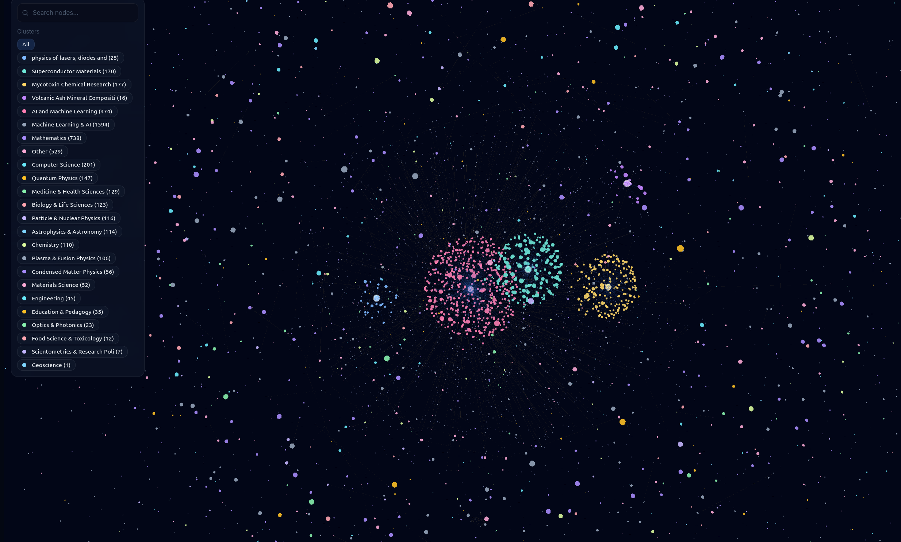
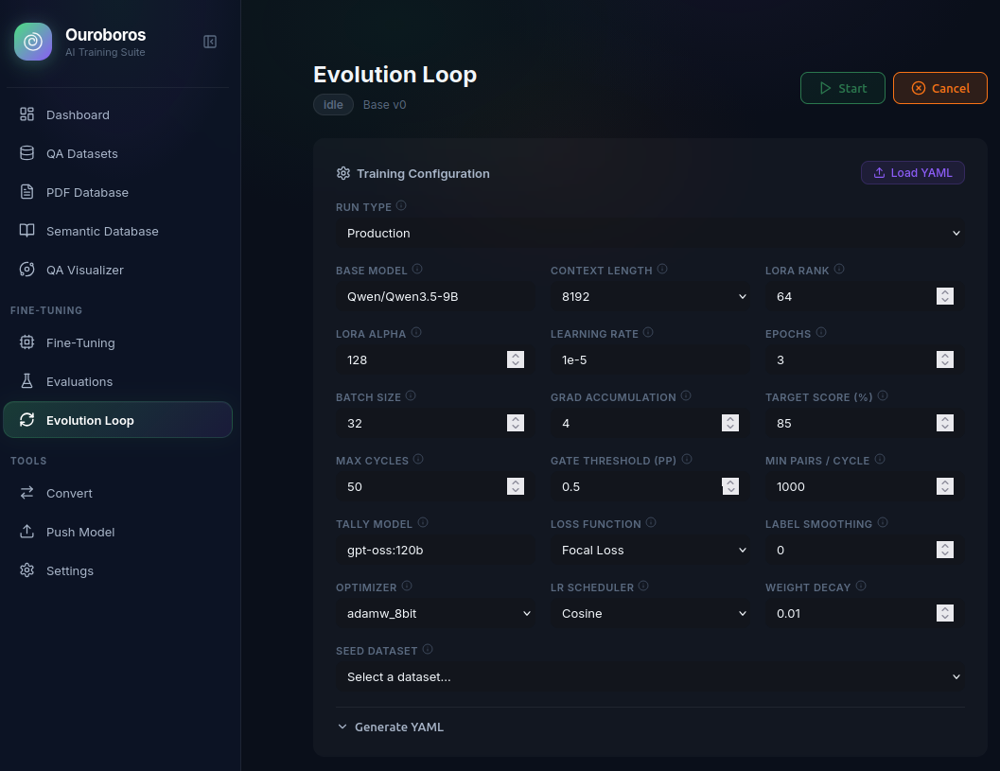
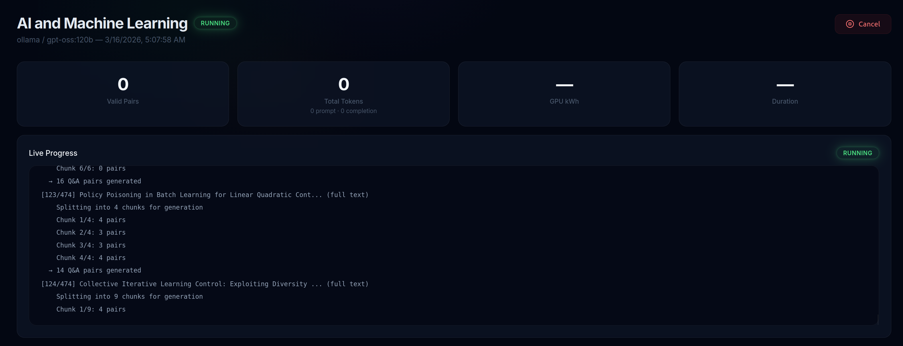
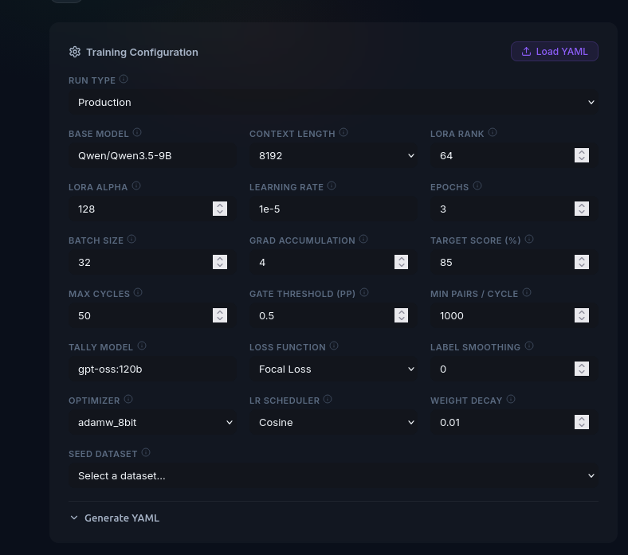
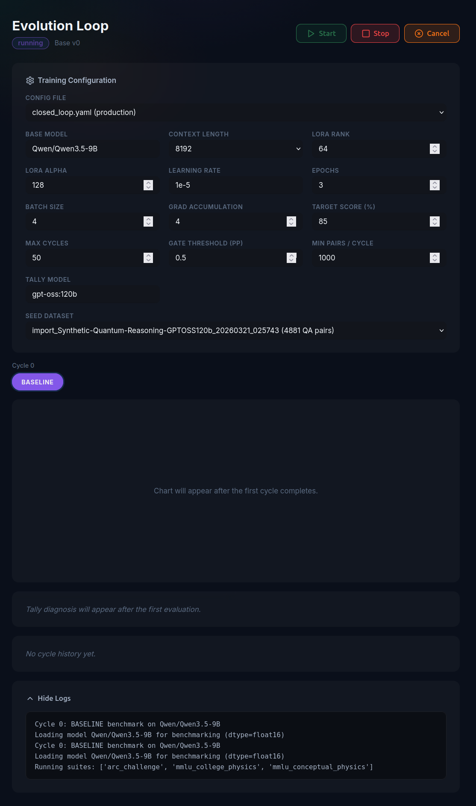

# Ouroborus


Full-stack platform for synthetic dataset generation, model fine-tuning, evaluation, and autonomous self-improvement loops. Generate reasoning datasets from scholarly papers, fine-tune models with LoRA, evaluate against public benchmarks, and let the closed loop diagnose weaknesses, retrieve papers, curate targeted training data, and improve the model iteratively.

### Supported APIs & Integrations


### Built With


---

### Modules

<table>
<tr>
<td width="50%">

**Knowledge Galaxy**
3D force-directed visualization of papers, datasets, and Q&A relationships with topic clustering


</td>
<td width="50%">

**Evolution Loop**
Autonomous closed-loop training with benchmark evaluation, tally diagnosis, and quality gates


</td>
</tr>
<tr>
<td width="50%">

**Dataset Generation**
Multi-provider Q&A generation from scholarly papers with live progress streaming


</td>
<td width="50%">

**Training Configuration**
LoRA fine-tuning with full hyperparameter control, focal loss, and live metrics


</td>
</tr>
<tr>
<td width="50%">

**Knowledge Graph**
GPU-instanced 3D rendering of paper-dataset-QA relationships


</td>
<td width="50%">

**Loop Running**
Real-time monitoring with stage pipeline, benchmark charts, and tally diagnosis


</td>
</tr>
</table>

---

## Features

- **Multi-provider dataset generation** -- plug in any OpenAI-compatible LLM (Ollama, OpenAI, Anthropic, Gemini, Perplexity)
- **Paper-based pipelines** -- search Semantic Scholar, arXiv, OpenAlex, and CORE; fetch full text, generate Q&A pairs
- **Knowledge base** -- ChromaDB-backed semantic search and RAG chat over indexed PDFs with persistent background indexing
- **Web UI** -- glassmorphism dashboard, dataset management, training controls, evaluation viewer, 3D knowledge galaxy
- **3D Galaxy visualizer** -- GPU-instanced rendering of papers, datasets, and Q&A pairs with force-directed layout
- **Config-driven fine-tuning** -- LoRA training with YAML configs for models, datasets, and hyperparameters
- **Live training controls** -- adjust learning rate mid-run, cancel jobs, stream metrics via SSE/WebSocket
- **RAG-grounded evaluation** -- judge models score responses against paper sources
- **Correction agent** -- Claude identifies and rewrites failing samples back into the training set
- **Merge and quantize** -- LoRA merge + GGUF conversion in one step
- **HuggingFace integration** -- import datasets, push models and datasets to the Hub
- **Evolution loop** -- autonomous generate -> train -> evaluate -> analyze cycle that improves models iteratively
- **Closed-loop self-feeding** -- benchmark-driven training loop: diagnose failures with LangChain tally agent, retrieve papers on weak areas, generate chain-of-thought reasoning datasets with 3-layer verification (citation matching, NLI entailment, chunk tracing), train via merge-and-continue LoRA, quality gate with rollback

## Supported Providers

| Provider | Model Examples | Key Required |
|----------|---------------|--------------|
| **Ollama** (local) | `qwen3:32b`, `gpt-oss:120b`, `llama3` | No |
| **OpenAI** | `gpt-4o`, `o1-mini` | `OPENAI_API_KEY` |
| **Anthropic** | `claude-sonnet-4-20250514`, `claude-opus-4-20250514` | `ANTHROPIC_API_KEY` |
| **Google Gemini** | `gemini-2.0-flash`, `gemini-2.5-pro` | `GEMINI_API_KEY` |
| **Perplexity** | `sonar-pro`, `sonar-deep-research` | `PERPLEXITY_API_KEY` |

## Installation

```bash
pip install -e .

# With web UI and training engine
pip install -e ".[web]"

# With closed-loop training
pip install -e ".[loop]"

# With GPU power tracking
pip install -e ".[gpu]"

# Development
pip install -e ".[dev]"
```

## Quick Start

### Closed-loop self-feeding training

```bash
# Install loop dependencies
pip install -e ".[loop]"

# Start a closed-loop run
sdgs closed-loop start --config configs/closed_loop.yaml
```

### Web UI

The primary interface for dataset management, training, evaluation, and visualization.

## How the Closed Loop Works

The closed loop is an autonomous system that teaches a small model (7-8B parameters) to reason at an expert level on a single domain. It does this by repeatedly finding what the model doesn't know, retrieving papers that contain that knowledge, generating training data from those papers, and training the model on that data. Every cycle, the model gets smarter -- or the cycle is discarded and retried with a different approach.

### The Cycle

```
                          +------------------+
                          |  [0] BASELINE    |  Run benchmarks on the unmodified model.
                          |  Establish       |  This is the starting score -- the number
                          |  starting scores |  to beat.
                          +--------+---------+
                                   |
                    +--------------v---------------+
                    |  [1] TALLY                    |  A LangChain agent (gpt-oss:120b via
                    |  Diagnose failures            |  Ollama) reads every question the model
                    |                               |  got wrong. It doesn't just count
                    |  "Why did the model fail?"    |  failures -- it clusters them by
                    |  "What knowledge is missing?" |  knowledge gap. Example: "Model confuses
                    |  "What should we teach it?"   |  T1/T2 decoherence timescales" rather
                    |                               |  than just "quantum physics is weak."
                    |  Outputs: failure clusters,   |
                    |  search queries, generation   |  It also avoids re-targeting gaps that
                    |  guidance                     |  were already fixed in prior cycles.
                    +--------------+----------------+
                                   |
                    +--------------v---------------+
                    |  [2] RETRIEVE                 |  Semantic Scholar and arXiv APIs
                    |  Find papers on weak areas    |  retrieve papers matching the tally
                    |                               |  agent's search queries. Full text
                    |  Sources:                     |  is extracted from PDFs via PyMuPDF.
                    |  - Semantic Scholar API        |
                    |  - arXiv API                  |  Only papers relevant to the diagnosed
                    |                               |  knowledge gaps are retrieved.
                    +--------------+----------------+
                                   |
                    +--------------v---------------+
                    |  [3] CURATE                   |  gpt-oss:120b reads the papers and
                    |  Generate chain-of-thought    |  generates reasoning training pairs.
                    |  training data                |  Every response includes a full
                    |                               |  derivation chain, not just an answer.
                    |  3-layer verification:        |
                    |  [A] Citation matching --     |  Each generated pair is verified:
                    |      inline citations must    |  citations must resolve to real paper
                    |      resolve to real content  |  content, NLI confirms no contradictions,
                    |  [B] NLI entailment --        |  and embedding similarity ensures each
                    |      DeBERTa checks claims    |  reasoning step is grounded in the
                    |      against paper text       |  source material.
                    |  [C] Chunk tracing --         |
                    |      embedding similarity     |  Pairs that fail any check are discarded.
                    |      (MiniLM-L6-v2) confirms  |  1,000+ verified pairs per cycle minimum,
                    |      grounding                |  no upper cap.
                    +--------------+----------------+
                                   |
                    +--------------v---------------+
                    |  [4] TRAIN                    |  LoRA fine-tuning (4-bit quantized,
                    |  LoRA fine-tune on curated    |  nf4) on the curated dataset.
                    |  dataset                      |  3 epochs, cosine LR schedule.
                    |                               |  Fresh LoRA adapter each cycle --
                    |                               |  no adapter stacking.
                    +--------------+----------------+
                                   |
                    +--------------v---------------+
                    |  [5] MERGE                    |  The LoRA adapter is merged into the
                    |  Merge adapter into base      |  base model weights. After this, the
                    |  model weights                |  adapter is gone -- its knowledge is
                    |                               |  baked permanently into the model.
                    |  merge_and_unload() -> save   |
                    |  as HF format checkpoint      |  The merged model is saved as a
                    |                               |  versioned checkpoint (base-v1, v2...).
                    +--------------+----------------+
                                   |
                    +--------------v---------------+
                    |  [6] EVALUATE                 |  The merged model is benchmarked on
                    |  Benchmark the merged model   |  the same tests used for baseline.
                    |                               |
                    |  Benchmarks (via lm-eval):    |  GPQA Diamond: PhD-level science
                    |  - GPQA Diamond               |  reasoning. Used by OpenAI, Anthropic,
                    |  - MMLU college_physics       |  and Google to measure frontier model
                    |  - MMLU conceptual_physics    |  scientific capability.
                    |  - SciBench                   |
                    |                               |  MMLU: Massive Multitask Language
                    |  Gate metric:                 |  Understanding. Standard benchmark
                    |  average of all 4 scores      |  for knowledge across 57 subjects.
                    |                               |  We use the physics subsets.
                    |                               |
                    |                               |  SciBench: University-level science
                    |                               |  calculation problems requiring
                    |                               |  step-by-step reasoning.
                    +--------------+----------------+
                                   |
                    +--------------v---------------+
                    |  [7] GATE                     |  Did the average benchmark score
                    |  Quality control              |  improve by >= 0.5 percentage points?
                    |                               |
                    |  >= 0.5pp improvement:        |  YES: Keep the merged model. It becomes
                    |    KEEP merged model           |  the new base for the next cycle.
                    |    -> new base for next cycle  |  Old checkpoints cleaned up (keep
                    |                               |  last 5 + original).
                    |  < 0.5pp or regression:       |
                    |    ROLLBACK                   |  NO: Delete the merged model. Roll back
                    |    -> delete merged model      |  to the previous checkpoint. The tally
                    |    -> revert to last good      |  agent will diagnose differently next
                    |       checkpoint               |  cycle and generate different data.
                    |                               |
                    |  3 consecutive failures:      |  FAIL CAP: If the same base model fails
                    |    -> email analysis report    |  3 times in a row, email a diagnostic
                    |    -> pause for human review   |  report and pause for human review.
                    +--------------+----------------+
                                   |
                                   |  Loop back to [1] TALLY
                                   |  with the new (or same) base model
                                   v
```

### Merge-and-Continue

Each successful cycle permanently improves the model's weights:

```
Cycle 1: Original Qwen 7B + LoRA -> merge -> Base v1 (knows basic QM)
Cycle 2: Base v1 + LoRA -> merge -> Base v2 (+ perturbation theory)
Cycle 3: Base v2 + LoRA -> merge -> FAIL -> rollback to Base v2
Cycle 4: Base v2 + LoRA (different data) -> merge -> Base v3 (+ entanglement)
```

The model never gets worse. Failed cycles are discarded, not merged. The original base model is always preserved as the ultimate fallback.

### Benchmarks

The loop uses three public benchmarks via the [EleutherAI lm-eval harness](https://github.com/EleutherAI/lm-evaluation-harness):

| Benchmark | What It Tests | Level | Source |
|-----------|--------------|-------|--------|
| [**GPQA Diamond**](https://arxiv.org/abs/2311.12022) | Graduate-level science reasoning -- questions written by domain experts that PhD students in other fields struggle with | PhD | Rein et al., 2023 |
| [**MMLU**](https://arxiv.org/abs/2009.03300) (physics subsets) | Massive Multitask Language Understanding -- 57 subjects from elementary to professional level. We use `college_physics` and `conceptual_physics` | Undergrad | Hendrycks et al., 2021 |
| [**SciBench**](https://arxiv.org/abs/2307.10635) | University-level textbook problems requiring multi-step calculation and scientific reasoning | University | Wang et al., 2023 |

The gate metric is a simple average of all four benchmark task scores: `(GPQA + MMLU_college + MMLU_conceptual + SciBench) / 4`.

### Verification Pipeline

Every generated training pair passes three checks before being accepted:

| Check | Model | What It Verifies |
|-------|-------|-----------------|
| **Citation matching** | String matching | Inline citations like `[Paper: "Title", Section 3]` resolve to real paper content |
| **NLI entailment** | `deberta-v3-base-mnli` (~350MB) | No claim in the reasoning chain contradicts the source paper. At least 50% of claims must be positively entailed |
| **Chunk tracing** | `all-MiniLM-L6-v2` (~80MB) | Each reasoning step has cosine similarity >= 0.3 with at least one chunk from the source papers |

Pairs failing any check are discarded to `curation_rejects.jsonl` for debugging. If accepted pairs fall below the minimum (1,000), more are generated and re-verified.

### VRAM Management

The loop runs on a single GPU. Models are loaded and unloaded sequentially -- only one large model in VRAM at a time:

```
TALLY + CURATE:  gpt-oss:120b (via Ollama)     + verification models (~430MB)
TRAIN:           7-8B base (4-bit, ~5GB)        + LoRA adapter
MERGE:           7-8B base (FP16, ~14-16GB)     + adapter for merge
EVALUATE:        merged model (HF format)        via lm-eval
```

### Termination

The loop stops when any of these conditions are met:

| Condition | Default | What Happens |
|-----------|---------|-------------|
| Target reached | 85% average benchmark score | Stop, report success |
| Fail cap | 3 consecutive gate failures | Email report to operator, pause |
| Max cycles | 50 | Stop, report final state |
| Manual stop | `sdgs closed-loop stop` | Graceful halt after current stage |

```bash
# Install web dependencies
pip install -e ".[web]"

# Build the frontend (requires Node.js)
cd sdgs/web/frontend && npm install && npm run build && cd -

# Start the server
sdgs serve
```

Open `http://localhost:8000` in your browser. Register an account, then:

1. **Create a dataset** -- pick a topic and provider, watch Q&A pairs stream in
2. **Browse papers** -- search, filter by topic, scrape new papers from multiple academic sources
3. **Index knowledge base** -- embed PDFs into ChromaDB for semantic search and RAG chat (progress persists across pages)
4. **Explore the Galaxy** -- 3D force-directed visualization of papers, datasets, and Q&A relationships
5. **Start training** -- select a model config (e.g. `qwen2.5-7b-instruct`) and training config
6. **Evaluate** -- run a judge model against test samples with RAG grounding
7. **Correct** -- trigger the Claude correction agent on failing samples
8. **Convert** -- merge LoRA adapter and quantize to GGUF
9. **Push** -- upload your model or dataset to HuggingFace

## Architecture

```
CLI Pipeline:
  scrape/extract -> generate -> filter -> qa

Web Pipeline:
  create dataset -> fine-tune -> evaluate -> correct -> merge/convert -> push to HF

Knowledge Base:
  PDFs -> chunk (RecursiveCharacterTextSplitter) -> embed (MiniLM-L6-v2) -> ChromaDB
       -> semantic search / RAG chat (Ollama)

Evolution Loop (legacy):
  generate -> format -> install config -> train -> convert -> evaluate -> analyze
     ^                                                                      |
     '---------- feedback (weak domains, sample budgets, error patterns) ---'

Closed Loop (self-feeding):
  baseline benchmark -> tally agent diagnoses failures -> retrieve papers
     ^                                                         |
     |    gate (keep/rollback) <- eval <- merge <- train <- curate CoT data
     '--- quality gate passes: merge-and-continue, next cycle ----'
```

## CLI Reference

| Command | Purpose |
|---------|---------|
| `sdgs serve` | Launch the web interface |
| `sdgs closed-loop start` | Start a closed-loop self-feeding training run |
| `sdgs closed-loop status` | Show closed-loop status |
| `sdgs closed-loop stop` | Gracefully stop the closed loop |

Additional CLI tools for scripting: `sdgs scrape`, `sdgs generate`, `sdgs filter`, `sdgs qa`, `sdgs extract`.

## Web API

The web server exposes a REST API under `/api/`:

| Area | Endpoints |
|------|-----------|
| **Auth** | `POST /api/auth/register`, `/login`, `/refresh` |
| **Datasets** | CRUD, batch create, create from papers, import from HF, push to HF |
| **Papers** | List, search, filter by topic, bulk delete, stream scrape from multiple sources |
| **Knowledge** | `POST /api/knowledge/index`, `GET /api/knowledge/index/events` (SSE), search, RAG chat, reset |
| **Training** | Start, list, detail, cancel, knobs (live LR adjustment) |
| **Evaluation** | Start, list, detail with per-sample results, correction agent |
| **Convert** | `POST /api/training/convert` -- LoRA merge + GGUF (synchronous) |
| **Push** | `POST /api/training/push` -- upload GGUF or merged model to HF |
| **Configs** | `GET /api/training/configs/{type}` -- list YAML configs |
| **Artifacts** | `GET /api/training/artifacts` -- list adapters, GGUFs, checkpoints |
| **Galaxy** | `GET /api/galaxy/data` -- 3D knowledge graph data |
| **Settings** | Encrypted API key storage for all providers |
| **Loop** | Start, stop, status, list evolution loops |
| **SSE** | `/api/events/datasets/{id}`, `/api/events/training/{id}`, `/api/knowledge/index/events` |
| **WebSocket** | `/ws/pulse/{run_type}/{run_id}` -- real-time training metrics |

## Configuration

### Providers

YAML files in `configs/providers/`. Any OpenAI-compatible endpoint works:

```yaml
name: my_provider
base_url: "https://api.myprovider.com/v1/"
api_key_env: "MY_PROVIDER_API_KEY"
default_model: "my-model-name"
```

### Task configs

YAML files in `configs/tasks/`. Define source, generation prompts, and validation rules.
See `configs/tasks/example_task.yaml` for the full template.

### Training configs

YAML files in `sdgs/web/engine/configs/`:

- `models/` -- base model, LoRA rank/alpha, target modules
- `datasets/` -- dataset path, field mapping, prompt template, splits
- `training/` -- learning rate, epochs, batch size, gradient accumulation

### Loop configs

YAML files in `configs/`:

- `loop.yaml` -- default loop config (all domains, full training)
- `loop_quick_test.yaml` -- minimal single-evolution test config

### Closed-loop configs

YAML files in `configs/`:

- `closed_loop.yaml` -- production closed-loop config (50 cycles, 85% target, GPQA+MMLU+SciBench)
- `closed_loop_test.yaml` -- minimal test config (3 cycles, single benchmark)

```yaml
gate:
  improvement_threshold: 0.5  # 0.5pp minimum to keep merge
  fail_cap: 3                 # pause after 3 consecutive failures

training:
  strategy: "merge-and-continue"
  base_model: "Qwen/Qwen2.5-7B-Instruct"
  checkpoint_dir: "models/merged/"
  max_checkpoints: 5

benchmarks:
  suites: [gpqa_diamond, mmlu_college_physics, mmlu_conceptual_physics, scibench]

tally:
  model: "gpt-oss:120b"
  max_clusters: 10

curation:
  model: "gpt-oss:120b"
  min_pairs_per_cycle: 1000
  format: "chain-of-thought"
  verification:
    citation_matching: true
    entailment_model: "microsoft/deberta-v3-base-mnli"
    embedding_model: "all-MiniLM-L6-v2"

termination:
  target_score: 85.0
  max_cycles: 50
```

## Project Structure

```
sdgs/
  cli.py              # Click CLI entry point
  classify.py          # Paper topic classification
  providers.py         # Provider registry and client factory
  generate.py          # Core generation logic with token tracking
  scrape.py            # Scholarly paper search and full-text extraction
  extract.py           # Data extraction (HuggingFace, JSON, JSONL)
  filter.py            # Post-processing filter and healer
  qa.py                # Dataset inspection and statistics
  validate.py          # Shared validation and healing utilities
  tracker.py           # Token usage and GPU power tracking

  loop/                # Evolution loop (autonomous self-improvement)
    orchestrator.py    # Legacy state machine: generate -> train -> evaluate -> analyze
    orchestrator_v2.py # Closed-loop: benchmark -> tally -> retrieve -> curate -> train -> merge -> eval -> gate
    tally_agent.py     # LangChain ReAct agent for failure diagnosis
    curator.py         # Chain-of-thought generation with 3-layer verification
    retriever.py       # Tally-driven paper retrieval
    benchmark_runner.py # lm-eval harness wrapper (GPQA, MMLU, SciBench)
    quality_gate.py    # Keep/rollback decision, checkpoint management
    cycle_logger.py    # Per-cycle and project-level logging
    email_reporter.py  # Fail cap email escalation
    vram.py            # Ollama model load/unload helpers
    config_v2.py       # Closed-loop configuration dataclasses
    state_v2.py        # Closed-loop state persistence (Stage, StopReason, CycleRecord)
    bridge.py          # Legacy HTTP client for the web API
    formatter.py       # Legacy SDGS output -> training format converter
    analyzer.py        # Legacy evaluation analysis
    config.py          # Legacy loop configuration loader
    state.py           # Legacy SQLite-backed loop state

  web/                 # Web application
    app.py             # FastAPI application
    auth.py            # JWT authentication and encryption
    schemas.py         # Pydantic request/response models
    db/                # SQLAlchemy models and database setup
    routers/           # API endpoints (auth, datasets, training, galaxy, knowledge, etc.)
    services/          # Background job runner, broadcasting, dataset/galaxy/knowledge services
    engine/            # Training engine
      trainer.py       # SFT training with LoRA and live metrics
      evaluator.py     # RAG-grounded judge evaluation
      correction_agent.py  # Claude-powered sample correction
      merge_convert.py # LoRA merge + GGUF quantization
      push_hf.py       # HuggingFace Hub upload
      training_service.py  # Metrics streaming and knob adjustment
      configs/         # YAML configs for models, datasets, training
    frontend/          # React + TypeScript SPA
      src/pages/       # Dashboard, Datasets, Training, Evaluations, Galaxy, KnowledgeBase, Loop, Settings
      src/components/  # Galaxy 3D canvas, IndexingBanner, dataset cards, layout
      src/store/       # Zustand stores (auth, datasets, training, loop, galaxy, knowledge, toast)

configs/
  providers/           # One YAML per LLM provider
  tasks/               # One YAML per domain/task
  loop.yaml            # Default evolution loop config
  loop_quick_test.yaml # Minimal test config
```

## License

MIT
