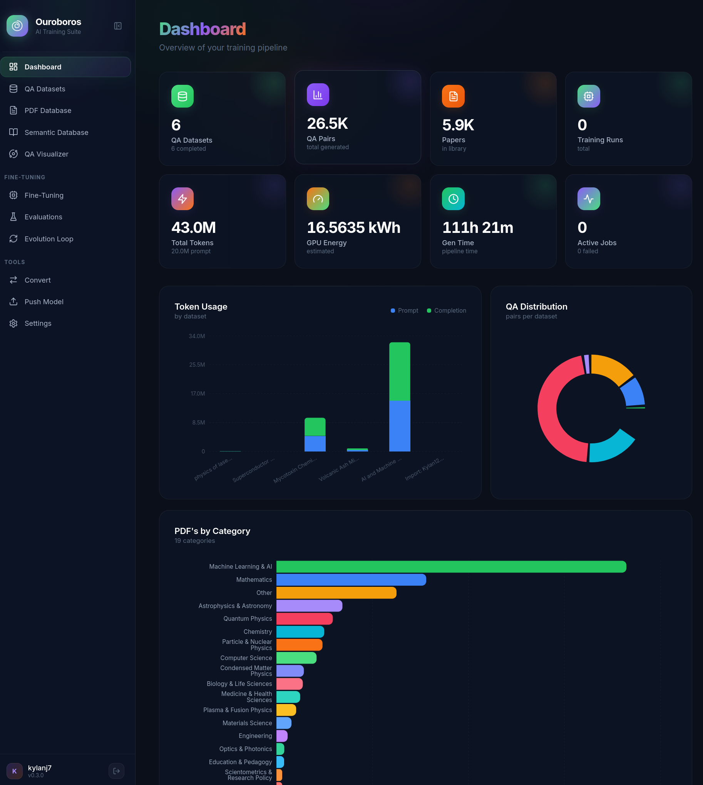
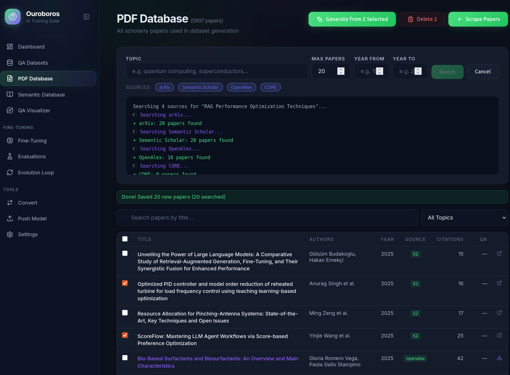
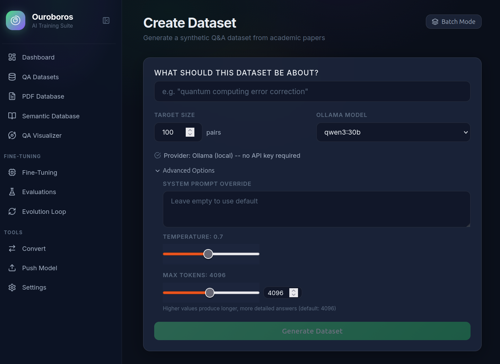
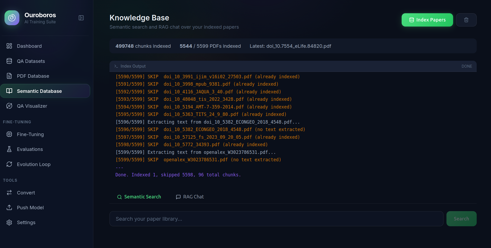
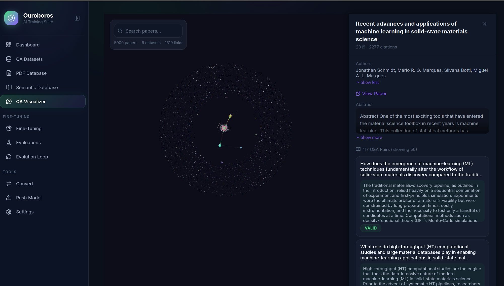
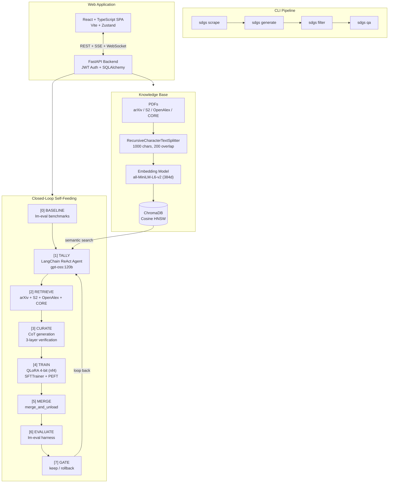

# Ouroborus

Full-stack platform for synthetic dataset generation, model fine-tuning, evaluation, and autonomous self-improvement loops. Generate reasoning datasets from scholarly papers, fine-tune models with LoRA, evaluate against public benchmarks, and let the closed loop diagnose weaknesses, retrieve papers, curate targeted training data, and improve the model iteratively.

### Supported APIs & Integrations


### Built With


---

### Modules

<table>
<tr>
<td width="50%">

**Dashboard**
Pipeline overview with token usage, GPU energy, generation time, QA distribution, and PDFs by category


</td>
<td width="50%">

**PDF Database**
Search and scrape papers from arXiv, Semantic Scholar, OpenAlex, and CORE with bulk generation


</td>
</tr>
<tr>
<td width="50%">

**Create Dataset**
Multi-provider Q&A generation with topic input, model selection, temperature, and system prompt control


</td>
<td width="50%">

**Knowledge Base**
ChromaDB-backed semantic search and RAG chat over 5,500+ indexed PDFs with 500K chunks


</td>
</tr>
<tr>
<td colspan="2">

**QA Visualizer**
Interactive knowledge graph with paper details, Q&A pair browsing, and citation links


</td>
</tr>
</table>

---

## Features

- **Multi-provider dataset generation** -- plug in any OpenAI-compatible LLM (Ollama, OpenAI, Anthropic, Gemini, Perplexity)
- **Paper-based pipelines** -- search Semantic Scholar, arXiv, OpenAlex, and CORE; fetch full text, generate Q&A pairs
- **Knowledge base** -- ChromaDB-backed semantic search and RAG chat over indexed PDFs with persistent background indexing
- **Web UI** -- glassmorphism dashboard, dataset management, training controls, evaluation viewer, 3D knowledge galaxy
- **3D Galaxy visualizer** -- GPU-instanced rendering of papers, datasets, and Q&A pairs with force-directed layout
- **Config-driven fine-tuning** -- LoRA training with YAML configs for models, datasets, and hyperparameters
- **Advanced training controls** -- LoRA dropout, RS-LoRA, target module selection, NEFTune noise, quantization type switching (NF4/FP4/INT8), warmup ratio, gradient clipping, live learning rate adjustment mid-run
- **RAG-grounded evaluation** -- judge models score responses against paper sources
- **Correction agent** -- Claude identifies and rewrites failing samples back into the training set
- **Merge and quantize** -- LoRA merge + GGUF conversion in one step
- **HuggingFace integration** -- import datasets, push models and datasets to the Hub
- **Closed-loop self-feeding** -- benchmark-driven training loop: diagnose failures with LangChain tally agent, retrieve papers on weak areas, generate chain-of-thought reasoning datasets with 3-layer verification (citation matching, NLI entailment, chunk tracing), train via merge-and-continue LoRA, quality gate with rollback

## Architecture



## Supported Providers

| Provider | Model Examples | Key Required |
|----------|---------------|--------------|
| **Ollama** (local) | `qwen3:32b`, `gpt-oss:120b`, `llama3` | No |
| **OpenAI** | `gpt-4o`, `o1-mini` | `OPENAI_API_KEY` |
| **Anthropic** | `claude-sonnet-4-20250514`, `claude-opus-4-20250514` | `ANTHROPIC_API_KEY` |
| **Google Gemini** | `gemini-2.0-flash`, `gemini-2.5-pro` | `GEMINI_API_KEY` |
| **Perplexity** | `sonar-pro`, `sonar-deep-research` | `PERPLEXITY_API_KEY` |

## Installation

```bash
pip install -e .

# With web UI and training engine
pip install -e ".[web]"

# With closed-loop training
pip install -e ".[loop]"

# With GPU power tracking
pip install -e ".[gpu]"

# Everything
pip install -e ".[web,loop,gpu]"

# Development
pip install -e ".[dev]"
```

### Frontend Build

```bash
cd sdgs/web/frontend
npm install
npm run build
cd -
```

### Prerequisites

| Dependency | Version | Purpose |
|---|---|---|
| Python | >= 3.10 | Runtime |
| Node.js | >= 18 | Frontend build |
| CUDA | >= 11.8 | GPU training |
| Ollama | latest | Local LLM inference |

## Quick Start

### Closed-loop self-feeding training

```bash
# Install loop dependencies
pip install -e ".[loop]"

# Start Ollama (separate terminal)
ollama pull gpt-oss:120b
ollama serve

# Start a closed-loop run
sdgs closed-loop start --config configs/closed_loop.yaml
```

### Web UI

```bash
# Install web dependencies
pip install -e ".[web]"

# Build the frontend (requires Node.js)
cd sdgs/web/frontend && npm install && npm run build && cd -

# Start the server
sdgs serve
```

Open `http://localhost:8000` in your browser. Register an account, then:

1. **Create a dataset** -- pick a topic and provider, watch Q&A pairs stream in
2. **Browse papers** -- search, filter by topic, scrape new papers from multiple academic sources
3. **Index knowledge base** -- embed PDFs into ChromaDB for semantic search and RAG chat
4. **Explore the Galaxy** -- 3D force-directed visualization of papers, datasets, and Q&A relationships
5. **Start training** -- select a model config and training config, adjust LoRA/quantization/optimizer parameters
6. **Evaluate** -- run a judge model against test samples with RAG grounding
7. **Correct** -- trigger the Claude correction agent on failing samples
8. **Convert** -- merge LoRA adapter and quantize to GGUF
9. **Push** -- upload your model or dataset to HuggingFace

---

## How the Closed Loop Works

The closed loop is an autonomous system that teaches a small model (7-9B parameters) to reason at an expert level on a single domain. It does this by repeatedly finding what the model doesn't know, retrieving papers that contain that knowledge, generating training data from those papers, and training the model on that data. Every cycle, the model gets smarter -- or the cycle is discarded and retried with a different approach.

### The Cycle

```
                       +--------------------+
                       |  [0] BASELINE      |  Run benchmarks on the unmodified model.
                       |  Establish         |  This is the starting score -- the number
                       |  starting scores   |  to beat.
                       +---------+----------+
                                 |
          +----------------------v-----------------------+
          |  [1] TALLY                                    |  A LangChain agent (gpt-oss:120b via
          |  Diagnose failures                            |  Ollama) reads every question the model
          |                                               |  got wrong. It doesn't just count
     +--->|  "Why did the model fail?"                    |  failures -- it clusters them by
     |    |  "What knowledge is missing?"                 |  knowledge gap. Example: "Model confuses
     |    |  "What should we teach it?"                   |  T1/T2 decoherence timescales" rather
     |    |                                               |  than just "quantum physics is weak."
     |    |  Outputs: failure clusters, search queries,   |
     |    |  generation guidance                          |  It also avoids re-targeting gaps that
     |    |                                               |  were already fixed in prior cycles.
     |    +----------------------+-----------------------+
     |                           |
     |    +----------------------v-----------------------+
     |    |  [2] RETRIEVE                                 |  Semantic Scholar, arXiv, OpenAlex,
     |    |  Find papers on weak areas                    |  and CORE APIs retrieve papers matching
     |    |                                               |  the tally agent's search queries.
     |    |  Sources:                                     |  Full text is extracted from PDFs
     ^    |  - Semantic Scholar API                       |  via PyMuPDF.
     |    |  - arXiv API                                  |
     |    |  - OpenAlex API                               |  Only papers relevant to the diagnosed
     |    |  - CORE API                                   |  knowledge gaps are retrieved.
     |    +----------------------+-----------------------+
     |                           |
     |    +----------------------v-----------------------+
     |    |  [3] CURATE                                   |  gpt-oss:120b reads the papers and
     |    |  Generate chain-of-thought training data      |  generates reasoning training pairs.
     |    |                                               |  Every response includes a full
     |    |  3-layer verification:                        |  derivation chain, not just an answer.
     |    |  [A] Citation matching --                     |
     |    |      inline citations must resolve            |  Each generated pair is verified:
     |    |      to real content                          |  citations must resolve to real paper
     |    |  [B] NLI entailment --                        |  content, NLI confirms no contradictions,
     |    |      DeBERTa checks claims against            |  and embedding similarity ensures each
     |    |      paper text                               |  reasoning step is grounded in the
     |    |  [C] Chunk tracing --                         |  source material.
     |    |      embedding similarity (MiniLM-L6-v2)      |
     |    |      confirms grounding                       |  Pairs that fail any check are discarded.
     |    |                                               |  1,000+ verified pairs per cycle minimum,
     |    |                                               |  no upper cap.
     |    +----------------------+-----------------------+
     |                           |
     |    +----------------------v-----------------------+
     |    |  [4] TRAIN                                    |  LoRA fine-tuning (4-bit quantized,
     |    |  LoRA fine-tune on curated dataset            |  nf4) on the curated dataset.
     ^    |                                               |  3 epochs, cosine LR schedule.
     |    |                                               |  Fresh LoRA adapter each cycle --
     |    |                                               |  no adapter stacking.
     |    +----------------------+-----------------------+
     |                           |
     |    +----------------------v-----------------------+
     |    |  [5] MERGE                                    |  The LoRA adapter is merged into the
     |    |  Merge adapter into base model weights        |  base model weights. After this, the
     |    |                                               |  adapter is gone -- its knowledge is
     |    |  merge_and_unload() -> save                   |  baked permanently into the model.
     |    |  as HF format checkpoint                      |
     |    |                                               |  The merged model is saved as a
     |    |                                               |  versioned checkpoint (base-v1, v2...).
     |    +----------------------+-----------------------+
     |                           |
     |    +----------------------v-----------------------+
     |    |  [6] EVALUATE                                 |  The merged model is benchmarked on
     |    |  Benchmark the merged model                   |  the same tests used for baseline.
     |    |                                               |
     |    |  Benchmarks (via lm-eval):                    |  GPQA Diamond: PhD-level science
     |    |  - GPQA Diamond                               |  reasoning. Used by OpenAI, Anthropic,
     |    |  - MMLU college_physics                       |  and Google to measure frontier model
     |    |  - MMLU conceptual_physics                    |  scientific capability.
     ^    |                                               |
     |    |  Gate metric:                                 |  MMLU: Massive Multitask Language
     |    |  average of all benchmark scores              |  Understanding. Standard benchmark
     |    |                                               |  for knowledge across 57 subjects.
     |    |                                               |  We use the physics subsets.
     |    +----------------------+-----------------------+
     |                           |
     |    +----------------------v-----------------------+
     |    |  [7] GATE                                     |  Did the average benchmark score
     |    |  Quality control                              |  improve by >= 0.5 percentage points?
     |    |                                               |
     |    |  >= 0.5pp improvement:                        |  YES: Keep the merged model. It becomes
     |    |    KEEP merged model                          |  the new base for the next cycle.
     |    |    -> new base for next cycle                 |  Old checkpoints cleaned up (keep
     |    |                                               |  last 5 + original).
     |    |  < 0.5pp or regression:                       |
     ^    |    ROLLBACK                                   |  NO: Delete the merged model. Roll back
     |    |    -> delete merged model                     |  to the previous checkpoint. The tally
     |    |    -> revert to last good checkpoint          |  agent will diagnose differently next
     |    |                                               |  cycle and generate different data.
     |    |  3 consecutive failures:                      |
     |    |    -> email analysis report                   |  FAIL CAP: If the same base model fails
     |    |    -> pause for human review                  |  3 times in a row, email a diagnostic
     |    |                                               |  report and pause for human review.
     |    +----------------------+-----------------------+
     |                           |
     |                           |  Loop back to [1] TALLY
     +--------------<------------+  with the new (or same) base model
```

### Merge-and-Continue

Each successful cycle permanently improves the model's weights:

```
Cycle 1: Original Qwen 9B + LoRA -> merge -> Base v1 (knows basic QM)
Cycle 2: Base v1 + LoRA -> merge -> Base v2 (+ perturbation theory)
Cycle 3: Base v2 + LoRA -> merge -> FAIL -> rollback to Base v2
Cycle 4: Base v2 + LoRA (different data) -> merge -> Base v3 (+ entanglement)
```

The model never gets worse. Failed cycles are discarded, not merged. The original base model is always preserved as the ultimate fallback.

### Benchmarks

The loop uses public benchmarks via the [EleutherAI lm-eval harness](https://github.com/EleutherAI/lm-evaluation-harness):

| Benchmark | What It Tests | Level | Source |
|-----------|--------------|-------|--------|
| [**GPQA Diamond**](https://arxiv.org/abs/2311.12022) | Graduate-level science reasoning -- questions written by domain experts that PhD students in other fields struggle with | PhD | Rein et al., 2023 |
| [**MMLU**](https://arxiv.org/abs/2009.03300) (physics subsets) | Massive Multitask Language Understanding -- 57 subjects from elementary to professional level. We use `college_physics` and `conceptual_physics` | Undergrad | Hendrycks et al., 2021 |
| [**MMLU-Pro**](https://arxiv.org/abs/2406.01574) | Extended MMLU with harder, multi-step reasoning problems across STEM domains | Graduate | Wang et al., 2024 |

The gate metric is a simple average of all benchmark task scores.

### Verification Pipeline

Every generated training pair passes three checks before being accepted:

| Check | Model | What It Verifies |
|-------|-------|-----------------|
| **Citation matching** | String matching | Inline citations like `[Paper: "Title", Section 3]` resolve to real paper content |
| **NLI entailment** | `deberta-v3-base-mnli` (~350MB) | No claim in the reasoning chain contradicts the source paper. At least 50% of claims must be positively entailed |
| **Chunk tracing** | `all-MiniLM-L6-v2` (~80MB) | Each reasoning step has cosine similarity >= 0.3 with at least one chunk from the source papers |

Pairs failing any check are discarded to `curation_rejects.jsonl` for debugging. If accepted pairs fall below the minimum (1,000), more are generated and re-verified.

### Termination

The loop stops when any of these conditions are met:

| Condition | Default | What Happens |
|-----------|---------|-------------|
| Target reached | 85% average benchmark score | Stop, report success |
| Fail cap | 3 consecutive gate failures | Email report to operator, pause |
| Max cycles | 50 | Stop, report final state |
| Manual stop | `sdgs closed-loop stop` | Graceful halt after current stage |

---

## Training Configuration

The Evolution Loop UI exposes the full set of fine-tuning parameters:

### Model & LoRA

| Parameter | Default | Description |
|---|---|---|
| Base Model | `Qwen/Qwen3.5-9B` | HuggingFace model ID or local path |
| Context Length | 8192 | Max token sequence length per sample |
| LoRA Rank | 64 | Rank of low-rank adaptation matrices |
| LoRA Alpha | 128 | Scaling factor (typically 2x rank) |
| LoRA Dropout | 0.1 | Dropout on LoRA layers (overfitting defense) |
| RS-LoRA | Off | Rank-Stabilized LoRA -- stable scaling across ranks without LR re-tuning |
| Target Modules | All 7 | `q_proj`, `k_proj`, `v_proj`, `o_proj` (attention) + `gate_proj`, `up_proj`, `down_proj` (MLP) |
| Quantization | NF4 | NF4 (4-bit NormalFloat), FP4, INT8, or None (full precision) |

### Training Hyperparameters

| Parameter | Default | Description |
|---|---|---|
| Learning Rate | 1e-5 | Step size for weight updates |
| Epochs | 3 | Full passes over the training data |
| Max Steps | -1 | Hard cap on steps (overrides epochs when > 0) |
| Batch Size | 32 | Samples per GPU per step |
| Grad Accumulation | 4 | Effective batch = batch_size x this value |
| Warmup Ratio | 0.03 | Fraction of total steps for LR warmup |
| Grad Clipping | 0.3 | Max gradient norm to prevent NaN loss |
| Weight Decay | 0.01 | L2 regularization penalty |
| NEFTune Alpha | Off | Noise added to embeddings for better generalization (5-15 typical) |
| Optimizer | `adamw_8bit` | Full dropdown including AdamW variants, SGD, Lion, AdEMAMix, GaLore, Schedule-Free |
| LR Scheduler | Cosine | Linear, Cosine, Constant+Warmup, Polynomial, Inverse Sqrt, Reduce on Plateau |
| Loss Function | Focal Loss | CrossEntropy, NLL, Focal, KLDiv, and 15+ other PyTorch loss functions |

### VRAM Management

The loop runs on consumer GPUs. Models are loaded and unloaded sequentially -- only one large model in VRAM at a time:

```
TALLY + CURATE:  gpt-oss:120b (via Ollama)     + verification models (~430MB)
TRAIN:           7-9B base (4-bit, ~5-8GB)      + LoRA adapter + optimizer states
MERGE:           7-9B base (FP16, ~14-16GB)     + adapter for merge
EVALUATE:        merged model (HF format)        via lm-eval
```

### Quantization Methods

| Method | VRAM (9B model) | Quality | Use Case |
|---|---|---|---|
| NF4 (4-bit NormalFloat) | ~5-6 GB | Good | Default for 24GB GPUs (3090) |
| FP4 (4-bit Float) | ~5-6 GB | Slightly lower | Alternative 4-bit |
| INT8 (8-bit) | ~10-12 GB | Higher fidelity | When VRAM permits |
| None (FP16/BF16) | ~14-18 GB | Full precision | Multi-GPU setups |

---

## Hardware Requirements

| Component | Minimum | Recommended | Notes |
|---|---|---|---|
| **GPU** | RTX 3090 (24GB) | 2-3x RTX 3090 | CUDA required. Single GPU for 7-9B training |
| **VRAM** | 24 GB | 48-72 GB | 24GB minimum for QLoRA on 9B. 72GB+ for gpt-oss:120b tally agent |
| **RAM** | 32 GB | 64 GB | Embedding models, ChromaDB, dataset processing |
| **Storage** | 250 GB SSD | 500 GB+ SSD | PDFs, checkpoints, vector store, model weights |
| **CPU** | 8 cores | 16 cores | Embedding on CPU, data loading |

### VRAM Budget (3x RTX 3090 = 73GB)

```
gpt-oss:120b weights (MXFP4):  ~65 GB
KV cache at 32k context:       ~3-6 GB
Remaining for overhead:        ~2-5 GB
```

---

## CLI Reference

The `sdgs` command exposes the full pipeline -- paper search, dataset generation, filtering, evaluation, training-loop control, and the web server. Run `sdgs --help` or `sdgs <command> --help` for in-terminal help. Group commands like `loop` and `closed-loop` have their own subcommands documented below.

| Group | Commands |
|---|---|
| Dataset pipeline | `extract`, `generate`, `filter`, `qa`, `scrape` |
| Discovery | `providers`, `tasks` |
| Evolution loop (legacy) | `loop start`, `loop status`, `loop stop`, `loop history` |
| Closed-loop training | `closed-loop start`, `closed-loop status`, `closed-loop stop` |
| Web | `serve` |

### Dataset pipeline

#### `sdgs extract`

Extract Q&A data from a configured source (HuggingFace dataset, JSON, or JSONL) into a normalized JSON file ready for `generate`.

| Flag | Default | Description |
|---|---|---|
| `--task` (required) | -- | Task config name (e.g. `quantum_reasoning`, `paper_qa`) |
| `-o`, `--output` (required) | -- | Output JSON file path |
| `-n`, `--sample` | all | Only extract first N examples |

#### `sdgs generate`

Run a configured task against any LLM provider to produce a reasoning JSONL dataset. Auto-resumes from the existing output file unless `--no-resume` is set.

| Flag | Default | Description |
|---|---|---|
| `--task` (required) | -- | Task config name |
| `--provider` (required) | -- | Provider name (`ollama`, `openai`, `anthropic`, `gemini`, `perplexity`) |
| `--model` | provider default | Override default model for the provider |
| `--api-key` | env var | API key (overrides env-var lookup) |
| `-i`, `--input` (required) | -- | Input JSON file produced by `extract` |
| `-o`, `--output` | `data/<task>_output.jsonl` | Output JSONL path |
| `--test` | off | Generate N samples with detailed validation output (debug mode) |
| `--no-resume` | off | Start fresh; do not resume from an existing output file |

#### `sdgs filter`

Validate and heal a generated JSONL dataset. By default runs in strict mode with healing enabled.

```
sdgs filter <input_file> [--output <path>] [--task <name>] [--lenient] [--no-heal]
```

| Flag | Default | Description |
|---|---|---|
| `<input_file>` (positional) | -- | JSONL dataset to filter |
| `-o`, `--output` | input + `.filtered.jsonl` | Output JSONL path |
| `--task` | -- | Task config to load domain-specific validation rules from |
| `--lenient` | strict | Only reject critical failures (missing answer tags) |
| `--no-heal` | heal on | Disable in-place healing of broken samples |

#### `sdgs qa`

Inspect and analyze a reasoning dataset -- show samples, statistics, or both.

```
sdgs qa <dataset> [-n <samples>] [-r] [-s] [--offset N] [--task <name>]
```

| Flag | Default | Description |
|---|---|---|
| `<dataset>` (positional) | -- | Path to JSONL dataset |
| `-n`, `--samples` | `5` | Number of samples to show |
| `-r`, `--random` | off | Random sampling instead of sequential |
| `-s`, `--stats` | off | Show statistics only, skip sample dump |
| `--offset` | `0` | Start from this sample index |
| `--task` | -- | Task config to load topic keywords from |

#### `sdgs scrape`

Search scholarly papers (arXiv, Semantic Scholar, OpenAlex, CORE), extract full text, and generate Q&A pairs in one step.

| Flag | Default | Description |
|---|---|---|
| `--topic` (required) | -- | Research topic to search for |
| `--provider` | -- | LLM provider for Q&A generation (required unless `--collect-only`) |
| `--model` | provider default | Override default model |
| `--api-key` | env var | API key (overrides env-var lookup) |
| `--task` | `paper_qa` | Task config name for generation prompts |
| `--max-papers` | `20` | Max papers to search for |
| `--top-n` | `5` | Fetch full text for top N papers (rest use abstracts) |
| `-o`, `--output` (required) | -- | Output JSONL path |
| `--collect-only` | off | Only collect paper metadata, skip generation |

### Discovery

#### `sdgs providers`

List all configured LLM providers, their default models, and which env var holds the API key.

#### `sdgs tasks`

List all available task configs from `configs/tasks/*.yaml`.

### Evolution loop (legacy)

The original evolution loop -- generate -> train -> evaluate -> feedback against a QFTL backend. Superseded by `closed-loop` for the merge-and-continue benchmark-driven flow, but retained for QFTL-backed runs.

#### `sdgs loop start`

| Flag | Default | Description |
|---|---|---|
| `--config` | `configs/loop.yaml` | Path to loop config YAML |

#### `sdgs loop status`

Show the status of the most recent evolution loop, including a per-evolution score history table.

#### `sdgs loop stop`

Request a graceful stop of the currently running loop. The loop halts after the current stage completes.

#### `sdgs loop history`

| Flag | Default | Description |
|---|---|---|
| `--limit` | `10` | Number of loops to show |

### Closed-loop training

The merge-and-continue self-feeding training loop: benchmark -> tally -> retrieve -> curate -> train -> merge -> evaluate -> gate. See [How the Closed Loop Works](#how-the-closed-loop-works) above for the full cycle.

#### `sdgs closed-loop start`

| Flag | Default | Description |
|---|---|---|
| `--config` | `configs/closed_loop.yaml` | Path to closed-loop config YAML |

On start, prints base model, benchmark suites, and tally model. On finish, prints final benchmark score and cycle count.

#### `sdgs closed-loop status`

Show the active closed-loop run -- current cycle, stage, last benchmark score, and whether the most recent gate passed.

#### `sdgs closed-loop stop`

Request a graceful stop. The loop halts after the current stage completes (the in-progress cycle is not abandoned mid-stage).

### Web server

#### `sdgs serve`

Build the React frontend (unless `--skip-build`) and launch the FastAPI app via Uvicorn.

| Flag | Default | Description |
|---|---|---|
| `--host` | `0.0.0.0` | Host interface to bind to |
| `--port` | `8000` | Port to bind to |
| `--reload` | off | Enable auto-reload for development |
| `--skip-build` | build on | Skip the `npm run build` frontend step |

## Web API

The web server exposes a REST API under `/api/`:

| Area | Endpoints |
|------|-----------|
| **Auth** | `POST /api/auth/register`, `/login`, `/refresh` |
| **Datasets** | CRUD, batch create, create from papers, import from HF, push to HF |
| **Papers** | List, search, filter by topic, bulk delete, stream scrape from multiple sources |
| **Knowledge** | `POST /api/knowledge/index`, `GET /api/knowledge/index/events` (SSE), search, RAG chat, reset |
| **Training** | Start, list, detail, cancel, retry, knobs (live LR adjustment) |
| **Evaluation** | Start, list, detail with per-sample results, correction agent |
| **Convert** | `POST /api/training/convert` -- LoRA merge + GGUF (synchronous) |
| **Push** | `POST /api/training/push` -- upload GGUF or merged model to HF |
| **Configs** | `GET /api/training/configs/{type}` -- list YAML configs |
| **Artifacts** | `GET /api/training/artifacts` -- list adapters, GGUFs, checkpoints |
| **Galaxy** | `GET /api/galaxy/data` -- 3D knowledge graph data |
| **Settings** | Encrypted API key storage for all providers |
| **Closed Loop** | Start, stop, cancel, status, history, events (SSE) |
| **SSE** | `/api/events/datasets/{id}`, `/api/events/training/{id}`, `/api/knowledge/index/events` |
| **WebSocket** | `/ws/pulse/{run_type}/{run_id}` -- real-time training metrics |

## Configuration

### Providers

YAML files in `configs/providers/`. Any OpenAI-compatible endpoint works:

```yaml
name: my_provider
base_url: "https://api.myprovider.com/v1/"
api_key_env: "MY_PROVIDER_API_KEY"
default_model: "my-model-name"
```

### Task configs

YAML files in `configs/tasks/`. Define source, generation prompts, and validation rules.
See `configs/tasks/example_task.yaml` for the full template.

### Training configs

YAML files in `sdgs/web/engine/configs/`:

- `models/` -- base model, LoRA rank/alpha, target modules, quantization
- `datasets/` -- dataset path, field mapping, prompt template, splits
- `training/` -- learning rate, epochs, batch size, gradient accumulation, optimizer

### Closed-loop configs

YAML files in `configs/`:

- `closed_loop.yaml` -- production closed-loop config (50 cycles, 85% target)
- `closed_loop_test.yaml` -- minimal test config (3 cycles, single benchmark)

```yaml
gate:
  improvement_threshold: 0.5  # 0.5pp minimum to keep merge
  fail_cap: 3                 # pause after 3 consecutive failures

training:
  strategy: "merge-and-continue"
  base_model: "Qwen/Qwen3.5-9B"
  checkpoint_dir: "models/merged/"
  max_checkpoints: 5

benchmarks:
  suites: [gpqa_diamond, mmlu_college_physics, mmlu_conceptual_physics]

tally:
  model: "gpt-oss:120b"
  max_clusters: 10

curation:
  model: "gpt-oss:120b"
  min_pairs_per_cycle: 1000
  format: "chain-of-thought"
  verification:
    citation_matching: true
    entailment_model: "microsoft/deberta-v3-base-mnli"
    embedding_model: "all-MiniLM-L6-v2"

termination:
  target_score: 85.0
  max_cycles: 50
```

## Project Structure

```
sdgs/
  cli.py              # Click CLI entry point
  classify.py          # Paper topic classification (21 physics categories)
  providers.py         # Provider registry and client factory
  generate.py          # Core generation logic with token tracking
  scrape.py            # Scholarly paper search and full-text extraction
  extract.py           # Data extraction (HuggingFace, JSON, JSONL)
  filter.py            # Post-processing filter and healer
  qa.py                # Dataset inspection and statistics
  validate.py          # Shared validation and healing utilities
  tracker.py           # Token usage and GPU power tracking

  loop/                # Evolution loop (autonomous self-improvement)
    orchestrator_v2.py # Closed-loop: benchmark -> tally -> retrieve -> curate -> train -> merge -> eval -> gate
    tally_agent.py     # LangChain ReAct agent for failure diagnosis
    tally_tools.py     # Agent tools: Semantic Scholar search, training history, analysis submission
    curator.py         # Chain-of-thought generation with 3-layer verification
    retriever.py       # Tally-driven paper retrieval from 4 academic APIs
    benchmark_runner.py # lm-eval harness wrapper (GPQA, MMLU, MMLU-Pro)
    quality_gate.py    # Keep/rollback decision, checkpoint management
    cycle_logger.py    # Per-cycle and project-level JSONL logging
    email_reporter.py  # Fail cap email escalation
    vram.py            # Ollama model load/unload helpers
    config_v2.py       # Closed-loop configuration dataclasses
    state_v2.py        # SQLite-backed state persistence (Stage, StopReason, CycleRecord)

  web/                 # Web application
    app.py             # FastAPI application with CORS, static files, router mounts
    auth.py            # JWT authentication, bcrypt hashing, Fernet encryption
    schemas.py         # Pydantic request/response models with validation
    db/                # SQLAlchemy models (Dataset, Paper, TrainingRun, EvaluationRun, User, Settings)
    routers/           # API endpoints (auth, datasets, training, galaxy, knowledge, papers, settings, etc.)
    services/          # Background job runner, SSE broadcasting, dataset/galaxy/knowledge services
    engine/            # Training engine
      trainer.py       # QwenTrainer: SFTTrainer + PEFT LoRA with live metrics and custom loss functions
      evaluator.py     # RAG-grounded judge evaluation
      correction_agent.py  # Claude-powered sample correction
      merge_convert.py # LoRA merge + GGUF quantization
      push_hf.py       # HuggingFace Hub upload
      training_service.py  # Metrics streaming and knob adjustment
      configs/         # YAML configs for models, datasets, training
    frontend/          # React + TypeScript SPA
      src/pages/       # Dashboard, Datasets, Training, Evaluations, Galaxy, KnowledgeBase, Loop, Settings
      src/components/  # Galaxy 3D canvas, IndexingBanner, dataset cards, loop visualizations
      src/store/       # Zustand stores (auth, datasets, training, loop, galaxy, knowledge, toast)

configs/
  providers/           # One YAML per LLM provider (ollama, openai, anthropic, gemini, perplexity)
  tasks/               # One YAML per domain/task (quantum_reasoning, paper_qa, example_task)
  closed_loop.yaml     # Production closed-loop config
  closed_loop_test.yaml # Minimal test config
```

## Technical Stack

| Layer | Technology | Details |
|---|---|---|
| **Frontend** | React 18 + TypeScript | Vite 5.4 build, Zustand state, Three.js galaxy, Lucide icons |
| **Backend** | FastAPI + SQLAlchemy | JWT auth, Pydantic v2 validation, SSE + WebSocket streaming |
| **Database** | SQLite | 6 tables: User, Dataset, Paper, TrainingRun, EvaluationRun, Settings |
| **Vector DB** | ChromaDB | HNSW index, cosine similarity, persistent file-based storage |
| **Embeddings** | sentence-transformers | all-MiniLM-L6-v2 (384d, ~80MB) for chunk tracing and knowledge search |
| **Training** | PyTorch + PEFT + TRL | QLoRA (4-bit nf4), SFTTrainer, BitsAndBytes quantization |
| **Evaluation** | lm-eval harness | EleutherAI benchmark suite (GPQA, MMLU, MMLU-Pro) |
| **Agent** | LangChain + LangGraph | ReAct agent for failure diagnosis with tool use |
| **NLI** | DeBERTa v3 | Zero-shot classification for entailment verification |
| **PDF** | PyMuPDF | Text extraction from academic papers |
| **Paper Search** | arXiv, Semantic Scholar, OpenAlex, CORE | 4-source retrieval with deduplication and language filtering |

## Contributing

### Development Setup

```bash
git clone https://github.com/kylanj7/Ouroborus.git
cd Ouroborus
pip install -e ".[web,loop,gpu,dev]"
cd sdgs/web/frontend && npm install && cd -
```

### Running Tests

```bash
pytest tests/
```

### Code Style

- Python: `ruff` for linting and formatting
- TypeScript: standard ESLint + Prettier

### Guidelines

- Follow existing patterns when adding new routers, services, or components
- Training configs go in `sdgs/web/engine/configs/` as YAML
- New loop stages require updates to `state_v2.py` (Stage enum), `orchestrator_v2.py`, and the frontend `Loop.tsx`
- All Pydantic models in `schemas.py` -- use `field_validator` for input validation
- Frontend state management via Zustand stores in `src/store/`

## License

MIT
